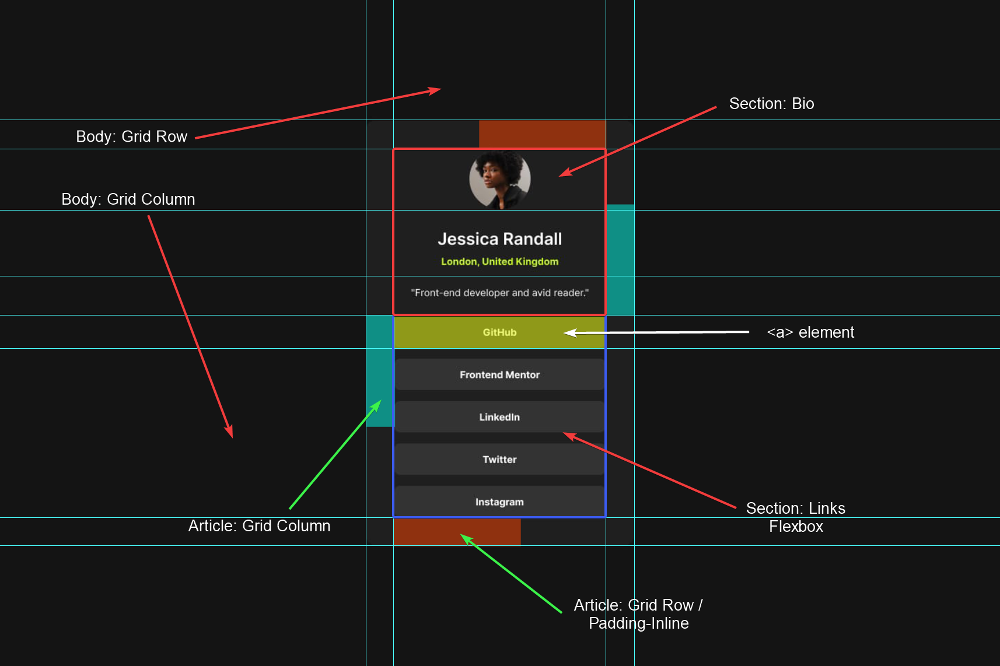

# JeffLangTech - Recipe page solution

This is a solution to the [Recipe page challenge on Frontend Mentor](https://www.frontendmentor.io/challenges/recipe-page-KiTsR8QQKm). 

## Table of contents

- [Overview](#overview)
  - [The challenge](#the-challenge)
  - [Preview](#preview)
  - [Links](#links)
- [My process](#my-process)
  - [Built with](#built-with)
  - [Step by step](#step-by-step)
  - [Continued development](#continued-development)
  - [Useful resources](#useful-resources)
- [Author](#author)

## Overview

### Preview


### Links

- Solution URL: [FrontEnd Mentor Solution](https://www.frontendmentor.io/solutions/css-grid-with-html-templates-and-json-data-loading-D0dMwlJPSb)
- Live Site URL: [Github](https://jefflangtech.github.io/recipe-card/)

## My process

### Built with

- Semantic HTML5 markup
- CSS custom properties
- CSS Grid

### Step by step

This time I went big with grid everywhere, and I definitely learned a few things!

I find it helpful to markup a screenshot of the design:

I did **not** use grid columns on the left/right of the article element. Those became padding rules.

Super useful: grid columns and rows on the body for centering content, even when going from desktop to mobile. Any 1fr grid column or row will grow to fill the space as needed, and then can shrink to 0px when the screen resizes. 

```css
body {
  font-family: 'Inter', sans-serif;
  font-size: 1.75rem;
  font-weight: normal;
  color: var(--white);
  background-color: var(--grey-900);
  display: grid;
  grid-template-columns: 
    minmax(1px, 1fr) 
    [content-start] clamp(40.875rem, 87.2%, 48rem) [content-end] 
    minmax(1px, 1fr);
  grid-template-rows: 1fr auto 1fr;
  position: relative;
}
```

There IS a quirky behavior when the screen starts shrinking down below typical or expected sizes, and since I have clamped widths on the grid, the content itself won't resize anymore: some of the content starts getting pushed off the sides of the screen. It doesn't happen evenly, even with a justify-content rule set. **You can trick the browser into keeping content centered, even at super small sizes, by not letting those outside columns go to zero via the minmax(1px, 1fr) rule.**

The other thing I learned was **don't use a grid column when padding is more appropriate.** I think the browser just has a bit of an easier time with it, and grid areas with no content are subject to resizing at the browser's best algorithmic determination.

Also, I literally have one rule when the size goes from desktop to mobile, to adjust that padding:
```css
@media (max-width: 400px) {
  .card {
    padding-block: var(--spacing-24);
  }
}
```

### Continued development

I read about a nifty trick in the HTML spec that I wanted to try this time around but didn't because I just styled the &lt;a> elements appropriately. The trick, however, is when a link element is part of a grouping in a parent and the parent is physically larger in pixel size. When the parent is clicked, if the link is found in the parent, it will trickle down the click to the link itself. Seemed like a neat javascript trick.

### Useful resources

- [Kevin Powell: 3 underused CSS Grid Features](https://www.youtube.com/watch?v=ciuZJE74wBA) - This wasn't the original video I saw, but he does still explain how to manipulate content across grid columns using named grid lines. I'm finding constraining content to specific named grid areas very useful.

## Author

- Website - [JeffLangTech](https://jefflangtech.github.io/)
- Frontend Mentor - [@jefflangtech](https://www.frontendmentor.io/profile/jefflangtech)