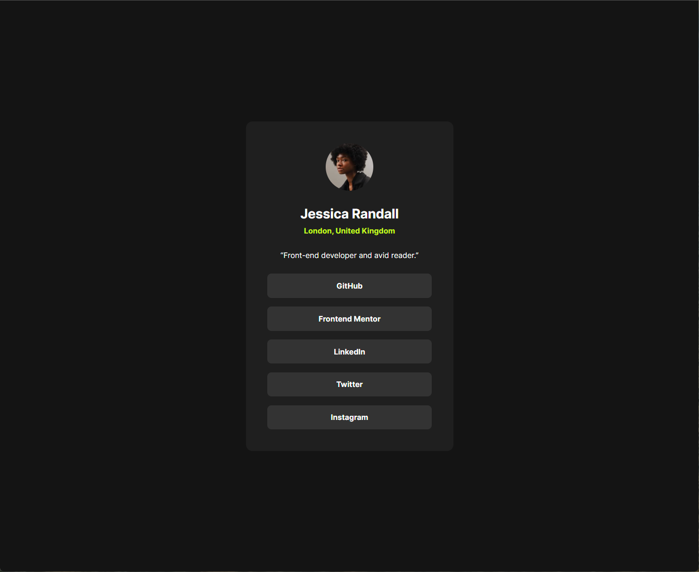

# JeffLangTech - Recipe page solution

This is a solution to the [Recipe page challenge on Frontend Mentor](https://www.frontendmentor.io/challenges/recipe-page-KiTsR8QQKm). 

## Table of contents

- [Overview](#overview)
  - [The challenge](#the-challenge)
  - [Preview](#preview)
  - [Links](#links)
- [My process](#my-process)
  - [Built with](#built-with)
  - [Step by step](#step-by-step)
  - [Continued development](#continued-development)
  - [Useful resources](#useful-resources)
- [Author](#author)

## Overview

### Preview


I forgot to move the mouse cursor, haha.

### Links

- Solution URL: [FrontEnd Mentor Solution](https://www.frontendmentor.io/solutions/css-grid-with-html-templates-and-json-data-loading-D0dMwlJPSb)
- Live Site URL: [Github](https://jefflangtech.github.io/recipe-card/)

## My process

### Built with

- Semantic HTML5 markup
- CSS custom properties
- CSS Grid
- HTML Templates

### Step by step

I went big-to-small when approaching the styling. This was the first time that I tried keeping all the layout rules at the document level (in this case I went grid) and plugged in components that had no margin of their own, only concerned with styling their internal contents. 

I find it helpful to markup a screenshot of the design:

I also missed one grid row, since the hero image needs to occupy its own row, and then I was able to break it out when switching to mobile. I used named grid lines to do that.

Here is all the content in the center column, between [start-col] and [end-col].

```css
main {
  display: grid;
  grid-template-columns: 
    [start-left] 5rem 
    [start-col] 656px [end-col] 
    5rem [end-right];
  grid-template-rows: repeat(auto-fit, minmax(100px, auto));
  row-gap: 4rem;
}
main > * {
  grid-column: start-col / end-col;
  grid-row: auto;
}
```

Breaking the hero image out just means to set the grid-column to [start-left] / [end-right]. Pretty nifty!

Finally, here is my custom element in the JS (I excluded the content setter method). First time using custom elements and I'll probably spend some time exploring those use cases more.

```js
class RecipeCard extends HTMLElement {
  constructor() {
    super();
    this.template = document.createElement("template");
    this.template.innerHTML = `
      <h2 id="card-title"></h2>
      <div id="card-body">
        <slot></slot>
      </div>
    `;
  }

  connectedCallback() {
    this.appendChild(this.template.content.cloneNode(true));
  }
}

customElements.define('recipe-card', RecipeCard);
```

### Continued development

I went light DOM for this project, preferring to let styling for my injected component elements come from global rules. I did structure the CSS in a way that it would have been pretty easy to go shadow DOM and encapsulate component styling, but I'll do that with a future challenge. I also want to try using shadow DOM components that get styling from the global rules, as that sounds like a more complicated challenge.

### Useful resources

- [Kevin Powell: 3 underused CSS Grid Features](https://www.youtube.com/watch?v=ciuZJE74wBA) - This wasn't the original video I saw, but he does still explain how to manipulate content across grid columns using named grid lines. I used this to break out the hero image in the mobile view.

## Author

- Website - [JeffLangTech](https://jefflangtech.github.io/)
- Frontend Mentor - [@jefflangtech](https://www.frontendmentor.io/profile/jefflangtech)